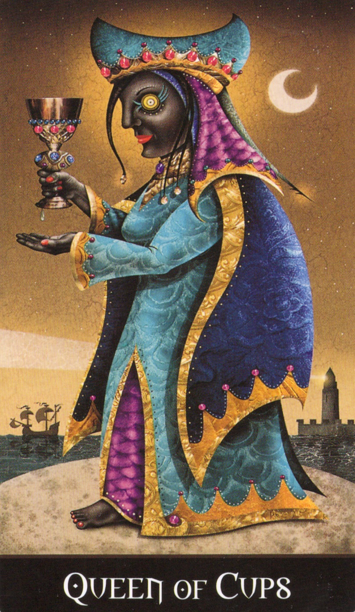

# 🏕️ Night Work of the Four Elements（四元素の夜のワーク）

⛺ **自然やキャンプ場で夜に行う、Deviant Moon Tarot の4枚のカードを使った象徴的な内的ワークです。**

これは形式的な儀式ではなく、各元素とのつながりを深め、ヘカテとの直感的な対話を促すための感覚ベースの内的ワークです。

---

## 🌍 Earth — Page of Pentacles（地のワーク）
- キャンプ場で**小石を一つ**見つけて、手のひらにのせます。
- **Page of Pentacles のカード**をじっくり観察し、目を閉じてもはっきり思い出せるようにします。
- 石に向かって**言葉にならない言葉（ジベリッシュ）や心の中で語りかけ**てみましょう。
- その石が何を見てきたか、どこから来たのか、何を伝えようとしているか問いかけます。
- 答えは期待せず、ただ**感覚として受け取る**ことを大切にします。

## 🔥 Fire — Wands 6（火のワーク）
- 安全な範囲で**焚き火を起こし**ます。
- 炎の**動き・形・色**を観察しましょう。
- 火が生きている存在であるかのように捉え、**コントロールではなく、呼びかけるように意識で働きかけてみます。**
- パチパチという音、炎の揺れなど、そこに**応答の兆し**を感じてください。

## 💨 Air — Swords 6（風のワーク）
- そよ風のある場所、夜風を感じられるところで座りましょう。
- 目を閉じて、自分が**Swords 6 の飛行船**に乗って空を旅しているとイメージします。
- 皮膚全体で風を感じるようにし、**風に話しかけてみます。**
- 風が何かを運び、混乱を洗い流してくれるように祈ります。
- **風からの返答は、感覚的な変化や圧で伝わってくるかもしれません。**

## 🌊 Water — Queen of Cups（水のワーク）
- コップに水を注ぐ、または近くの川や湖のほとりに座りましょう。
- **Queen of Cups のカード**を思い浮かべ、その**感情の女王としての存在感**を感じ取ります。
- 水に向かって「あなたは何を運び、何を覚えているのか」と問いかけてみてください。
- 水面を見つめながら、**自分の中の感情の流れを聴く**ようにします。
- 最後に、ヘカテのアゾートがこの水を通じて流れているかのようにイメージし、**感謝の意**を捧げてください。

---

## 🌕 最後の黙想（Final Contemplation）

4つの元素ワークを終えたら、火のそばや暗がりで静かに座ってください。  
それぞれの元素が、自分の身体・感情・思考・霊性のどこに触れたかを感じてみましょう。

そして、心の中で以下の祈りを唱えてください：

> “Hekate, Guardian of the Crossroads,  
> May these elements carry my truth to you.  
> May your azoth guide my soul across the night.”  
> （十字路の女神ヘカテよ、  
> この元素たちが私の真実をあなたに届けてくれますように。  
> あなたのアゾートが私の魂を夜の中で導いてくださいますように。）

目を閉じ、しばらくその感覚に身を委ねてください。

---

## 📚 関連文書（Related Works）

- `work_the_moon_hekate.md`：ヘカテのアゾートを受信する儀式[🔗 work_the_moon_hekate.md](https://github.com/ravensgate-tux/work_the_moon_hekate/blob/main/README.md)
- この「アゾート（Azoth）」とは、ヘカテと繋がるための霊的な光線のようなもので、現代的には非二次元的・全方位的な明晰さをもたらす通信プロトコルと捉えることができます。
  
---

## 📋 License

© 2025 知られざる呪術師（Le Sorcier Inconnu）  
本ドキュメントは [Creative Commons BY-SA 4.0](https://creativecommons.org/licenses/by-sa/4.0/deed.ja) に基づき公開されています。
